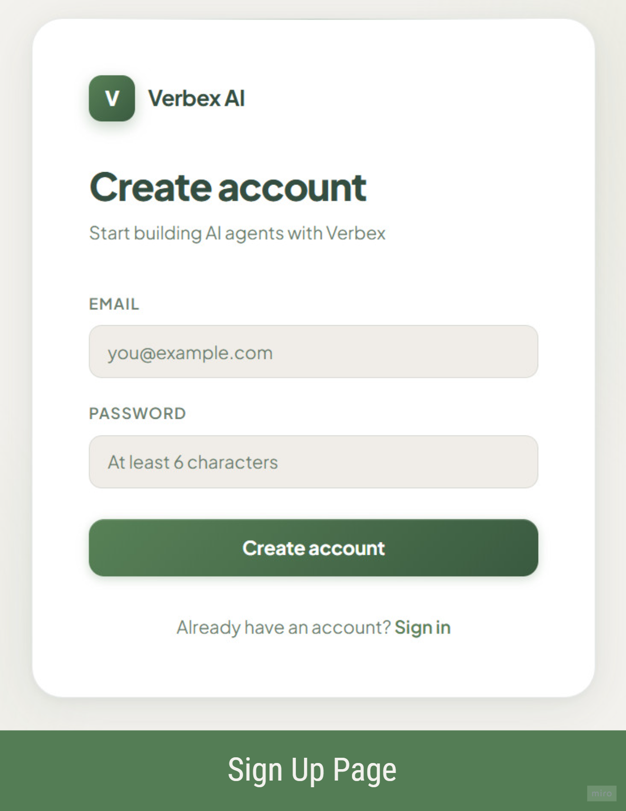
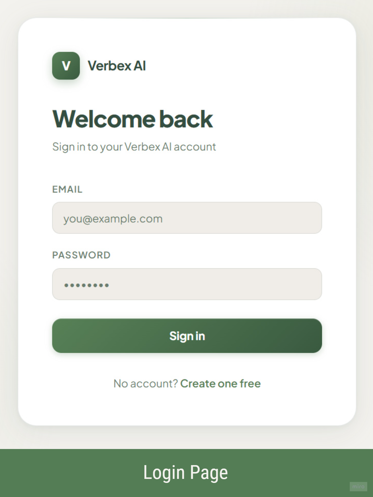
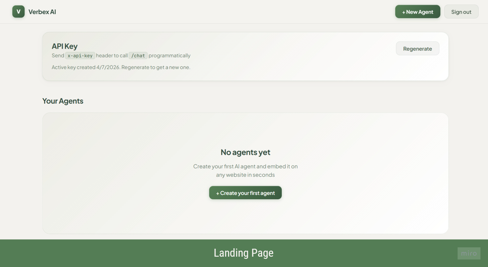
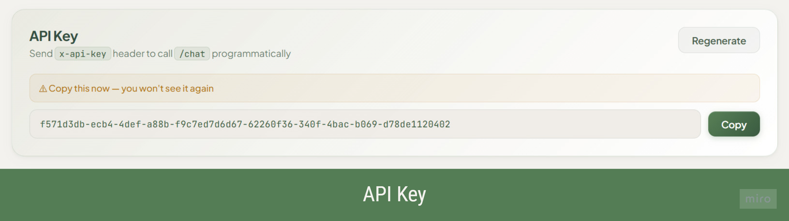
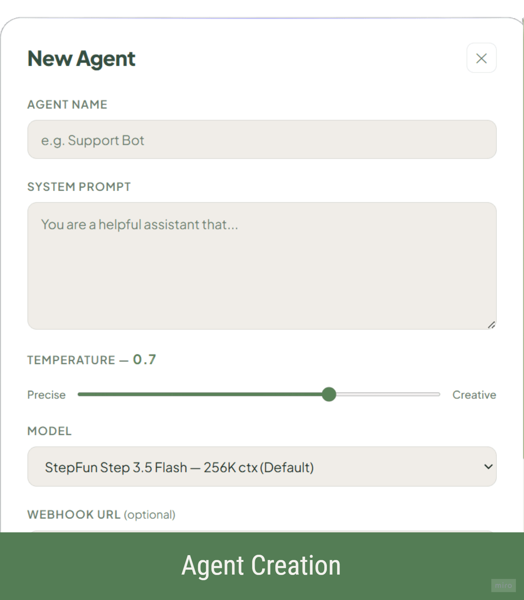
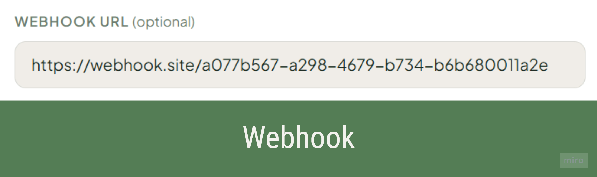
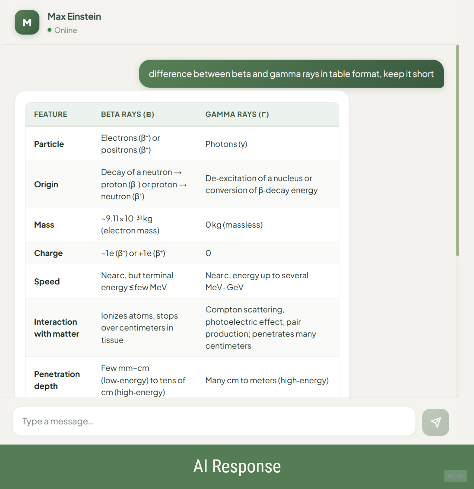
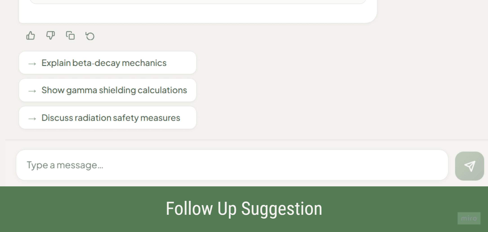
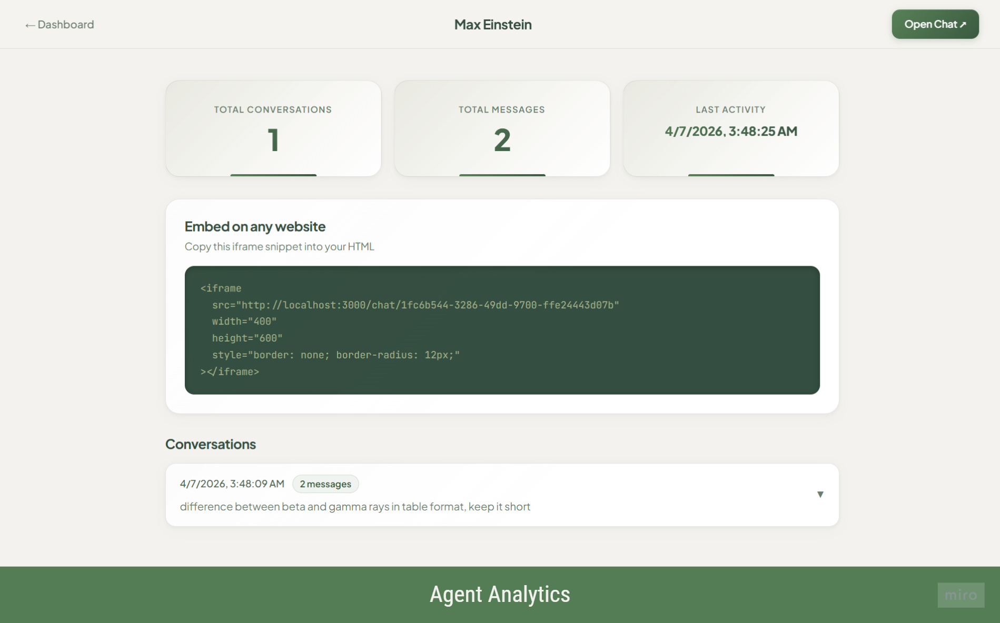

# Project Demo

This project demonstrates how our application works in real time.

---
## Walkthrough Video

  

> Click the image above to watch the full video on YouTube.

## Screenshots

